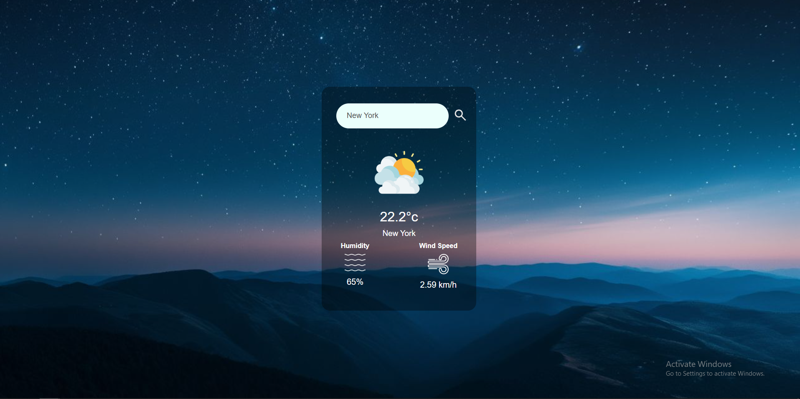
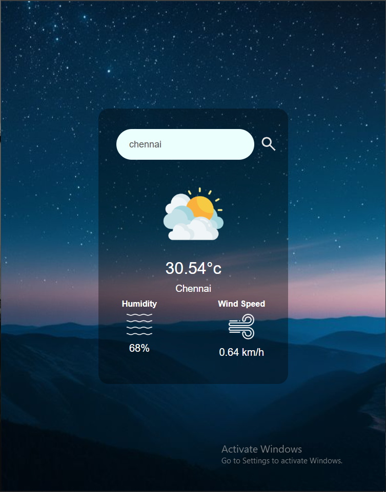
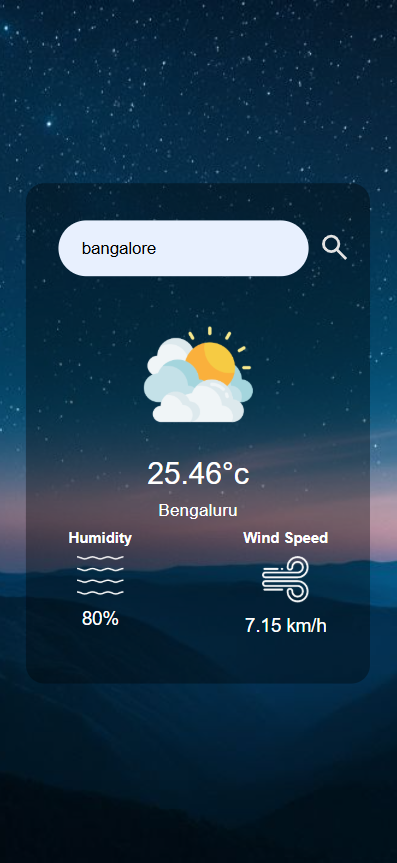

# 🌤️ Weather Web App

A sleek and fully responsive **Weather Web Application** that displays real-time weather data for any city using the **OpenWeatherMap API**. Built with HTML, CSS (Glassmorphism style), and JavaScript.

---

## 📸 Screenshots

| Desktop View | Mobile View | Tablet View |
|--------------|-------------|-------------|
|  |  |  |

---

## 🌐 Live Demo

- [Click here to view live demo!](https://deeps1970.github.io/ApexPlanet-Task3-Internship/)

---

## 🛠️ Features

- 🔍 City-based weather search  
- 🌡️ Displays temperature, humidity, and wind speed  
- 💻 Fully responsive design (Mobile, Tablet, Desktop)  
- 🧊 Modern UI using **glassmorphism** effect  
- 🔄 Fetches real-time weather data using **OpenWeatherMap API**

---

## 🚀 Tech Stack

- **HTML5**
- **CSS3** (Flexbox + Glassmorphism UI)
- **JavaScript (Vanilla JS)**
- **OpenWeatherMap API**

---

## 🔧 How to Run Locally

   ```bash
1. Clone the repo: git clone https://github.com/your-username/WeatherWebApp.git
2.Get your API key from OpenWeatherMap
3.Replace your_api_key_here in script.js with your API key: const apiKey = "your_api_key_here";
```

---

## 🧠 Learning Highlights

- Mastered asynchronous JavaScript (async/await & fetch)
- Practiced responsive UI design
- Worked with real-time RESTful APIs
- Used semantic HTML and clean CSS structuring

---

## 📣 Connect with Me

📌 Portfolio: [](https://deeps1970.github.io/Deeps1970/)
📧 Email: [](mailto:thiagarajandeepu2007@gmail.com)
🔗 LinkedIn : [](https://www.linkedin.com/in/deepak1970/)

---

## ⭐️ Show Your Support

If you liked this project, drop a ⭐️ on the repo or share your feedback!

---

## 📄 License

- This project is licensed under the MIT License.

---
